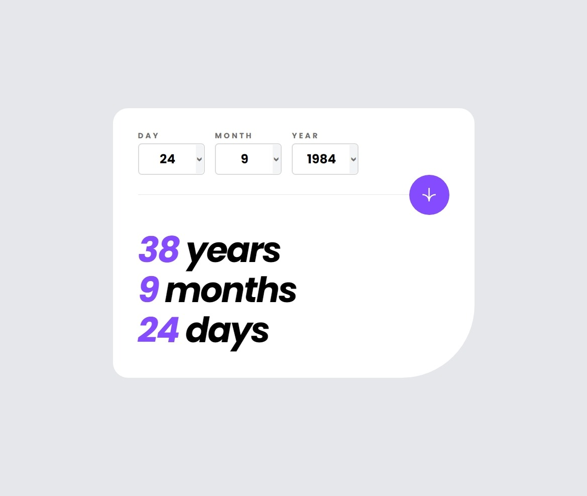

# Frontend Mentor - Age calculator component solution

This is a solution to the [Age calculator component challenge on Frontend Mentor](https://www.frontendmentor.io/challenges/age-calculator-app-dF9DFFpj-Q). Frontend Mentor challenges help you improve your coding skills by building realistic projects. 

## Table of contents

- [Overview](#overview)
  - [The challenge](#the-challenge)
  - [Screenshot](#screenshot)
  - [Links](#links)
- [My process](#my-process)
  - [Built with](#built-with)
  - [What I learned](#what-i-learned)
  - [Continued development](#continued-development)
  - [Useful resources](#useful-resources)
- [Author](#author)

**Note: Delete this note and update the table of contents based on what sections you keep.**

## Overview

### The challenge

Users should be able to:

- View the optimal layout for the interface for mobile and desktop screens.
- Put their date of birth to get their age on years, months and days

### Screenshot

### Links

- Live Site URL: [Add live site URL here](https://nextjs-tailwind-sage.vercel.app/age-calculator)

## My process

### Built with

- HTML
- Flexbox
- Mobile-first workflow
- [React](https://reactjs.org/) - JS library
- [Next.js](https://nextjs.org/) - React framework
- [TailwindCSS](https://tailwindcss.com//) - For styles

**Note: These are just examples. Delete this note and replace the list above with your own choices**

### What I learned

Improved coding validations

### Continued development

I want to continue using Tailwind and Next.js to master them both.

## Author

- Frontend Mentor - [@Refer59](https://www.frontendmentor.io/profile/Refer59)

